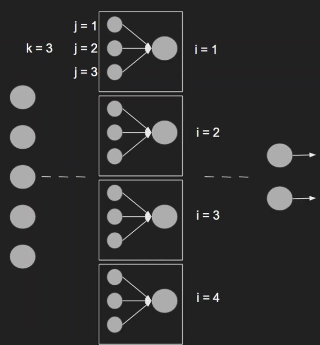
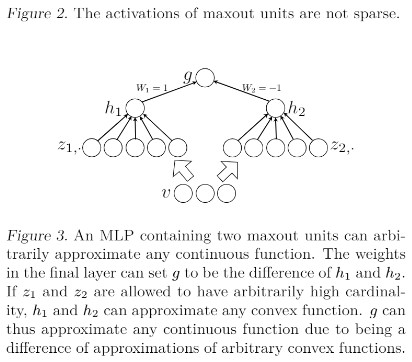

### **📈REPLICATING AND TESTING CUSTOM MAXOUT NETWORKS.**

**Purpose: Implementing a custom Maxout network from scratch (as an extension of nn.Module in PyTorch) and testing model performance on MNIST in comparison to ReLU networks to determine whether Maxout's more complex function approximations can provide higher accuracies in real-world use cases.**

Hey there! This notebook is meant to compare the performance of 4 MLP models with different activation functions on the MNIST dataset.
The first of these uses the typical ReLU activation, while the remaining three use various versions of **a custom maxout activation function** (replicating the original 2013 paper https://arxiv.org/abs/1302.4389) as defined in **Maxout.py**. 

The objective of this experiment is to see whether the theoretical benefits of Maxout work in real-world use cases. As outlined in the above paper, Maxout can (arbitrarily) approximate any continuous function as it acts much like a piecewise linear approximator - this is promising, as it means that both the ReLU and Leaky ReLU activation functions are both special cases of Maxout. Logically, this should mean that maxout can learn more complex functions and thus be able to better model an existing relationship.

Practically, the function works by splitting the input vector into *i* groups of *k* neurons each. Then, it takes the **MAXIMUM** for each one of these groups - turning the group of *k* neurons into just one. So, if there are 10 neurons in total, and we split the layer into groups of 2 ($i=2$, $k=5$), then that means that activation function will map those 10 neurons **to just 2** - taking the **highest activations and capturing the relationships that appear to have the most relevance**.

This essentially means that **maxout also has its own weights as it acts much like a linear transform* - this produces more trainable parameters but also offers the opportunity for better learning.

**Mathematically:**
$h_1(x)=max_{jΣ[1, k]}z_{ij}$, where $z_{ij}=x^TW_{...ij}+b_{ij}$

**Visually:** (credit to @MlforNerds https://www.youtube.com/watch?v=DTVlyP-VihU&t=403s):

### **➗Why does Maxout actually work? (The Math)**

As listed in the paper, there are ***two key principles*** that allow Maxout to (arbitrarily) approximate continuous functions. Consider the following neural network (from the original maxout paper):

In this case, $v$ is simply the input vector of the previous layer. This is then split into two groups -> $z_1$ and $z_2$ (or $i_1$ and $i_2$ if using the notation from the above example). Each of these groups has a **single maxout activation**, specified by $h_1$ and $h_2$. The two outputs of these activations (and by extension the two groups) are fed into $g$, in essence converting $z_1$ and $z_2$ into a single output.

Let's say, theoretically, that the weights of $g$ learned to **subtract the results from $h_2$ to $h_1$** - finding the difference between both functions. In theory, this last unit **should be able to approximate ANY continuous function**, as a result of:

1. Two convex PWL (piecewise linear) functions **can be subtracted to generate ANY CONTINUOUS PWL FUNCTION**. Remember that Maxout basically approximates smooth functions in small "pieces". While this allows it to approximate convex functions, one Maxout unit alone cannot approximate any **non-convex PWL continuous function.** However, two of these convex PWL functions, when subtracted, can yield a continuous function -> meaning **that since $g(v) = h_1(v)-h_2(v)$ (since its a difference of two convex PWLs) it can approximate any continuous PWL function.**

2. If we're trying to approximate a function, then *there exists a continuous PWL function that comes arbitrarily close* - in other words, if we choose an "error" $ε$ then there will be some PWL function that will yield less than $e$ when subtracted from the original function. More simply, $|f(v)-g(v)| < ε$ - meaning that **we can approximate any continuous function from any continuous PWL function with reasonable accuracy.**

All in all, this means that the shown maxout network **can map any input/output relationship quite well, without problems!**

### **📝Methodology + This Notebook.**

Three models will be trained on Handwritten digit classification via MNIST (344k samples) - ReLU, Maxout with Bias, Maxout without Bias, and Maxout **with Dropout** (more on this in the next section).

The ReLU model will be trained via FastAI, whereas the Maxout models will use FastAI *DataLoaders* and *Learners* but PyTorch for the training loop (as the activation function has been implemented separately). In the end, **all models are tested on the same 8 000 samples** and accuracy + confusion matrices are reported.

Feel free to clone this repo and try it out for yourself! Reach out to aditya.dewan124@gmail.com, @adidewan124 on Twitter, or via LinkedIn if you have any questions or ideas.

### 🎯**Results and Outcomes.**

Interestingly, despite higher function-modelling capabilities, the Maxout network (both with and without biases and dropout) fell short by ~3% in terms of test accuracy when compared to the regular ReLU network.

My hypothesis for this is that, despite having *higher potential to model functions, the excess parameters needed to be tuned by Maxout mean that they cause the model to be more overfitting-prone.* While the model achieves low training losses, the end accuracy on the test set **ends up being lower as excess parameters make it easier to adapt directly to the dataset rather than capture the underlying relationship behind it.** This explains why Maxout, as described by the paper, **is meant to be used in conjunction with Dropout** - more regularization is needed to unlock the function's full benefits.

Surprisingly, however, the "worst" (by approximately 5 percentage points) performing model was the combination of Maxout and Dropout - in direct contradiction to the above hypothesis. I believe this is the case **as models that have dropout take significantly longer to learn the same relationships** - as parts of the network and activation functions are quite literally shut off, each part of the network becomes less prone to overfitting; this of course makes it more difficult for the network to learn relationships, but makes it more likely that the relationships learned are in better conjunction with reality.

It appears that, despite being simpler, ReLU activations **allow the rest of the network to capture more meaningful relationships due to fewer parameters and increased simplicity!**

**🔑 Key takeaway: Simplicity > Complexity for most cases** (Maxout with Dropout, while the theoretical best-solution, require more resources to achieve performance - but may be justified in cases where accuracy is paramount). 

*Special thanks to Ian Goodfellow, David Warde-Farley, Mehdi Mirza, Aaron Courville, and Yoshua Bengio for coming up with the original concept back in 2013! Check out their paper here https://arxiv.org/abs/1302.4389*

### 💡**KEY LEARNINGS / ABOUT.**

This project is one of many attempting to expand my horizons in deep learning and beyond. Let me know if there are any other papers you'd like to see me replicate!

That being said - this one project provided invaluable lessons in terms of machine learning techniques. Namely:

1. 🧠 **The intricacies of FastAI and PyTorch.** Prior to this project, I worked primarily in TensorFlow - thanks to this project, I learned how to implement custom activation functions and layer models in PyTorch and use a mixture of mid-level FastAI APIs (such as DataBlocks and DataLoaders) to create new and better models.

2. ✖️ **The mathematical fundamentals behind machine learning.** For instance, what activation functions actually do behind the scenes, how they affect feature space and model predictions, and the role they (Maxout in particular) play in both reducing training times and modelling more complicated functions. And, some key PWL approximation formulas (potentially useful for future research 👀)!

3. 📈 **The delicate balance between accuracy, compute, and how even a single layer can exponentially impact either.** As discussed, while using more capable activations and layers can prove to be beneficial in the longer-term, the additional compute and training time required limits their use for applications where iteration is key. Simple activations, such as ReLU, can achieve higher accuracies in shorter periods of time, even if some degree of overfitting has occurred - it may prove to be a more fruitful pursuit to add regularization directly to ReLU models rather than training more capable ones in most cases!

4. ⚖️The drastic importance of **weight initialization**. Initially, the weight initializations of the Maxout function in Maxout.py were set to **random**, a practice which ended up generating hundreds of NaN and infinite values during training. Exploring weight initialization and different pooling techniques, the project taught me the value of **uniform and normal initializations** as well as best practices for both (such as setting the bounds to +- 1/sqrt(inputs) when dealing with uniform distributions). All in all, this was critical in helping me gain a **first-principles understanding of weight transformations.**

5. ✅**Good model evaluation techniques** - accuracies, confusion matrices, and the importance of model validation (as well as how to compare the performance of two models in a statistically sound manner; such as using the same test set with identical samples, disabling augmentation, and more).

Looking forward to doing more complex and challenging projects in the future! Let me know your thoughts.